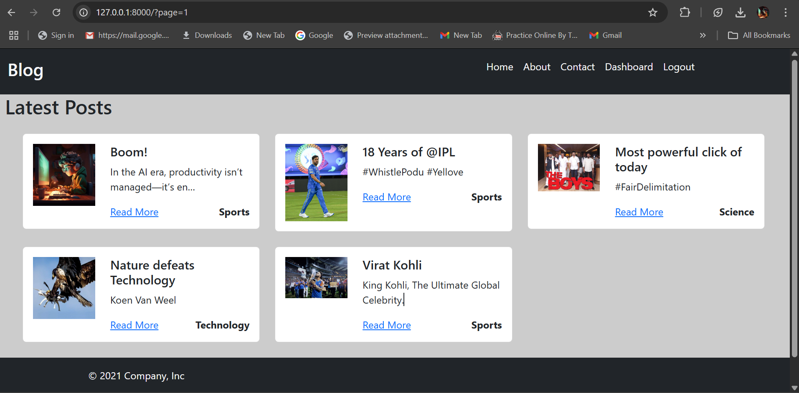
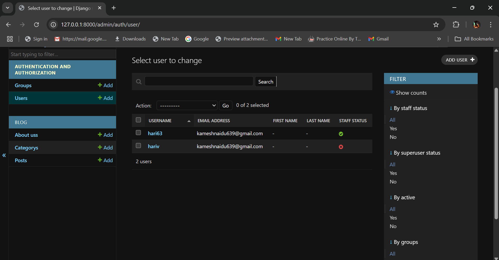

# Blog Post Django App

This is a Django-based blog application that allows users to create, edit, and manage blog posts.

## 📸 Screenshots

### 🏠 Home Page


### 🔍 Post Detail Page


## 🚀 Features
✅ User Authentication  
✅ Create, Edit & Delete Posts  
✅ Category-wise Post Management  
✅ Responsive UI  

## 🛠 Setup Instructions
1. Clone the repo  
   ```bash
   git clone https://github.com/kamesh63/Blog_post.git
